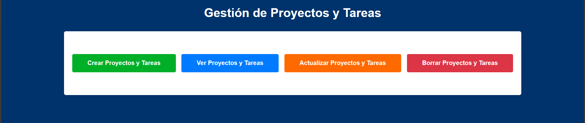
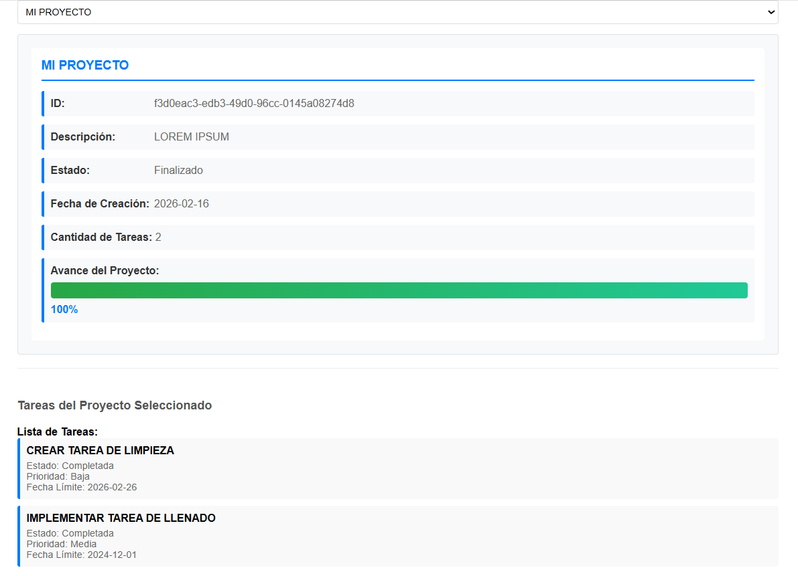
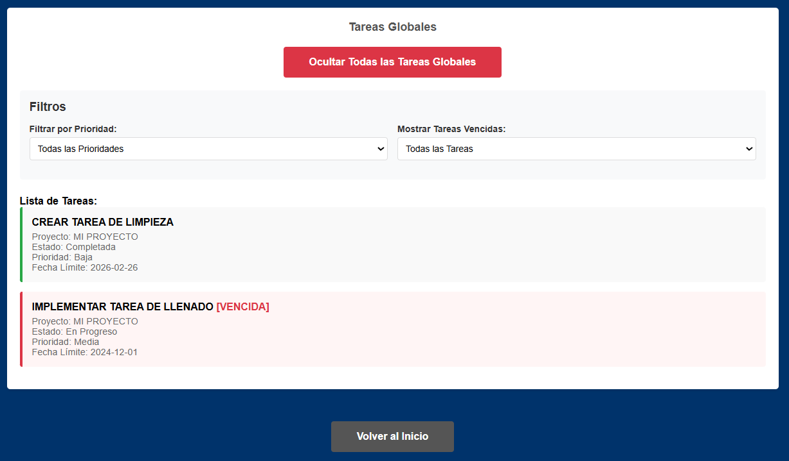

# Proyectos y Tareas - API REST

Una API REST construida con **.NET 8**, **Entity Framework Core** y **SQL Server** para la gestión integral de proyectos y tareas, con front end en **HTML/CSS/JavaScript**.

## Descripción General

Para este proyecto, se atendieron todos los requerimientos solicitados de la integridad que debía tener la API Rest, así como de los Endpoints para visualización de 
las Entidades solicitadas: Projectos y TaskItems.



## Arquitectura del Proyecto y Decisiones Técnicas

De acuerdo con los requerimientos de la API, se decidió organizar el proyecto por varias capas de seguridad, como lo haría una API en la vida real, separando las responsabilidades
por cada capa. Se integró el uso de async / await para priorizar las tareas más importantes, se inyectaron dependencias y se utilizaron DTOs para mayor seguridad. 
Todo fue comentado y organizado debidamente, para facilitar la lectura del código y su comprensión.

```
ProjectosYTareas_APIREST/
|
|── Controllers/                # Controladores API (endpoints)
│   ├── ProjectsController.cs
│   └── TaskItemsController.cs
|
|── Models/                     # Modelos de dominio
│   ├── Project.cs
│   ├── TaskItem.cs
│   ├── ProjectStatus.cs
│   ├── TaskEnums.cs
│   └── ErrorResponse.cs
|
|── DTOs/                       # Data Transfer Objects
│   ├── ProjectDto.cs
│   └── TaskItemDto.cs
|
|── Services/                   # Lógica de negocio
│   ├── IProjectService.cs
│   ├── ProjectService.cs
│   ├── ITaskItemService.cs
│   └── TaskItemService.cs
|
|── Repositories/              # Acceso a datos
│   ├── IProjectRepository.cs
│   ├── ProjectRepository.cs
│   ├── ITaskItemRepository.cs
│   └── TaskItemRepository.cs
|
|── Context/                   # Entity Framework DbContext
│   └── AppDbContext.cs
├── Migrations/                # Migraciones de BD
|
├── Middleware/                # Middleware personalizado
│   └── GlobalExceptionHandlingMiddleware.cs
|
├── Exceptions/                # Excepciones personalizadas
│   └── CustomExceptions.cs
|
└── Program.cs                 # Configuración inicial
```

---

## Funciones y Lógica de Negocio solicitadas e implementadas

**Gestión de Proyectos**
- CRUD Completo.
- Front-End para visualización de Porcentaje de avances en consulta de Projecto.
- Validaciones para:
  - Evitar borrar un proyecto si tiene tareas que no estén Completadas.
  - Finalizar un Proyecto sólo si todas las tareas están completadas.



**Gestión de Tareas**
-CRUD Completo.
- Filtro de Tareas Globales por Prioridad y Vencimiento.
- Relación automática con proyectos.
- Validaciones para:
  - Evitar marcar tareas como Completadas si están Pendientes.
  - Evitar asignar tareas con fechas pasadas a la actual.





---

## Estructura de Entidades

**Entidad Project**
```csharp
public class Project
{
    public Guid Id { get; set; }
    public string Name { get; set; }
    public string Description { get; set; }
    public ProjectStatus Status { get; set; }
    public DateOnly CreatedAt { get; set; }
    public ICollection <TaskItem> TaskItems { get; set; }
}
```


**Estados disponibles:**
- `Active` (Activo)
- `InProgress` (En Progreso)
- `Completed` (Completado)
- `Canceled` (Cancelado)

Estos estados están en otro documento, ya que en la entidad se encuentra solamente el enum.

**Entidad TaskItem**
```csharp
public class TaskItem
{
    public Guid Id { get; set; }
    public Guid ProjectId { get; set; }
    public string Title { get; set; }
    public string Description { get; set; }
    public TaskStatus Status { get; set; }
    public TaskPriority Priority { get; set; }
    public DateOnly DueDate { get; set; }
    public DateOnly CreatedAt { get; set; }
    public Project? Project { get; set; }
}
```

**Estados disponibles:**
- `InProgress` (En Progreso)
- `Completed` (Completada)
- `Pending` (Pendiente)


**Prioridades disponibles:**
- `High` (Alta)
- `Medium` (Media)
- `Low` (Baja)

Igualmente, estos estados están en otro documento, ya que en la entidad se encuentra solamente el enum.


## Estructura de Base de Datos

# Estructura de Tabla Projects
```sql

CREATE TABLE Projects (
    Id UNIQUEIDENTIFIER PRIMARY KEY,
    Name NVARCHAR(255) NOT NULL,
    Description NVARCHAR(MAX) NOT NULL,
    Status INT NOT NULL,
    CreatedAt DATE NOT NULL
);
```
# Estructura de Tabla de TaskItems
```sql
CREATE TABLE TaskItems (
    Id UNIQUEIDENTIFIER PRIMARY KEY,
    ProjectId UNIQUEIDENTIFIER NOT NULL,
    Title NVARCHAR(255) NOT NULL,
    Description NVARCHAR(MAX) NOT NULL,
    Status INT NOT NULL,
    Priority INT NOT NULL,
    DueDate DATE NOT NULL,
    CreatedAt DATE NOT NULL,
    FOREIGN KEY (ProjectId) REFERENCES Projects(Id)
);
```
